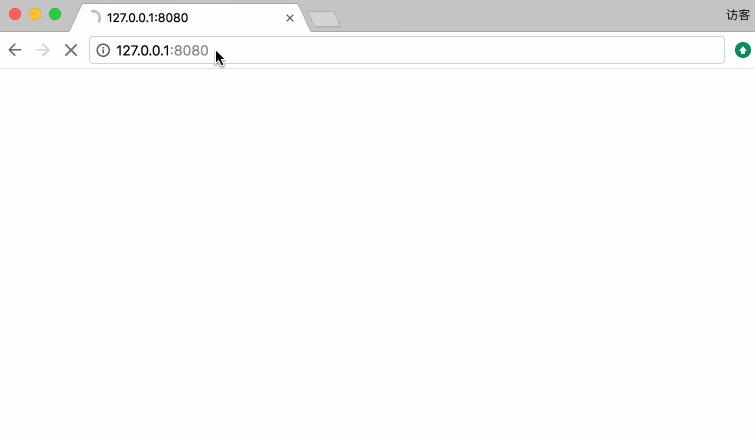

The Webserv Project
=======================

WebServ is an simple http file server. Effectively file upload, download and management can be done.
The project builds without any third-party dependence. It runs well across the platfrom only if golang supports.
Easily transfer and share images and videos among pc, server, iPhone, iPad and Android devices.
Considering safty, the server uses basic auth on base64, suitable for most conditions.

## Usage


## Install

### Compile from code
``` Shell
- go get github.com/aoaolion/webserv
- go build
```
### Download binary
- Mac
> NOT available
- Linux
> NOT available
- Windows
> NOT available

## Run

``` Shell
./weberv -d [file root] -h [listen ip] -p [listen port] -t [ttl] -u [username] -P [password]
```

The default listening address is 0.0.0.0:8080. And the default dir is file_root.
The default ttl is set 600, which equals to 10mins. If you do not want ttl, set the value to 0.

Notice: Basic auth works when uername is not empty!

## Close

There are three ways to shutdown this service.
- Via api, http://ip:port/close 
- Via OS signals, such as kill, ctl+c
- Via ttl method, on condition that the ttl value is not 0
